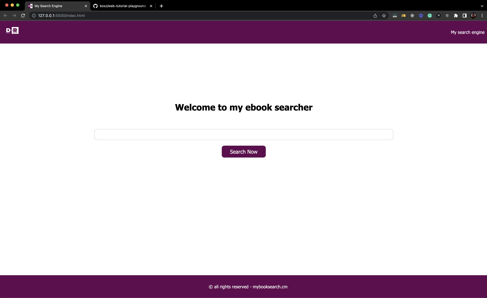

# Web dev training

This is a small repo i created to keep the code i am using during my 4 days web development training. 

## Covers
This repo covers the following
- HTML
- CSS
- JavaScript

The code here is very basic and meant for beginners. 

## Stages
1. **Project 1:** Basic search page that looks like google/bing

## Need a trainer?
Need me to assist as a trainer? I can do HTML, CSS, JavaScript, Typescript, PHP, Larave, React, React Native, VueJS, Firebase. Contact me on fongohmartin@gmail.com lets talk. 

